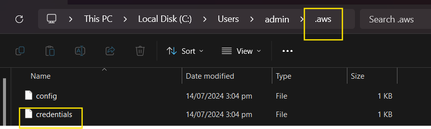
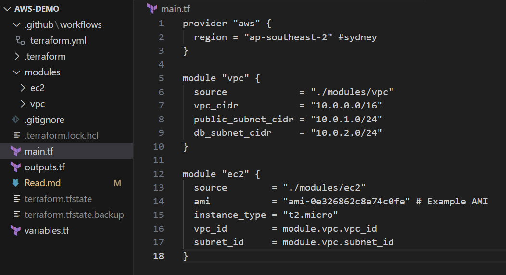

# Provisioning AWS Resources Using Terraform

## Step 1: Create an AWS Account with Free Tier
1. Go to the [AWS Free Tier page](https://aws.amazon.com/free/).
2. Click on "Create a Free Account" and follow the instructions to set up your account.

## Step 2: Create an IAM User with Requisite Permissions
1. Sign in to the AWS Management Console.
2. Navigate to **IAM** (Identity and Access Management).
3. Click on **Users** and then **Add user**.
4. Enter a username and select **Programmatic access**.
5. Attach existing policies directly and select the **AdministratorAccess** policy (or create a custom policy with required permissions).
6. Review and create the user.
7. Save the **Access key ID** and **Secret access key**.


## Step 3: Set Up an AWS Profile Using AWS CLI
1. Install AWS CLI from https://docs.aws.amazon.com/cli/latest/userguide/getting-started-install.html

    C:\> msiexec.exe /i https://awscli.amazonaws.com/AWSCLIV2.msi /qn

2. Open your terminal or command prompt.
3. Run the following command to configure AWS CLI:

    ```sh
    aws configure
    ```

4. Enter the **Access key ID**, **Secret access key**, **region**, and **output format** when prompted.



## Step 4: Write Modular Terraform Code to Provision Resources
1. Create a new directory for your Terraform project.
2. Inside this directory, create a `main.tf` file and define your resources. Here's an example of provisioning an EC2 instance:

 

## Step 5: Execute Terraform Commands
1. Initialize the Terraform configuration:

    ```sh
    terraform init
    ```

2. Validate the configuration:

    ```sh
    terraform validate
    ```

3. Plan the deployment:

    ```sh
    terraform plan
    ```

4. Apply the configuration to create the resources:

    ```sh
    terraform apply
    ```

5. To destroy the resources:

    ```sh
    terraform destroy
    ```


## Step 6: Set Up CI/CD via GitHub Actions
1. Create a `.github/workflows` directory in your repository.
2. Inside this directory, create a `main.yml` file with the following content:

    ```yaml
    name: Terraform

    on:
      push:
        branches:
          - master
      pull_request:
        branches:
          - master
      workflow_dispatch:

    jobs:
      terraform:
        name: 'Terraform'
        runs-on: ubuntu-latest

        steps:
          - name: Checkout code
            uses: actions/checkout@v2

          - name: Setup Terraform
            uses: hashicorp/setup-terraform@v1

          - name: Terraform Init
            run: terraform init

          - name: Terraform Plan
            run: terraform plan

          - name: Terraform Apply
            run: terraform apply -auto-approve
    ```


## Step 7: Create a New User for GitHub Actions
1. Sign in to the AWS Management Console.
2. Navigate to **IAM** and create a new user (or use the one created in step 2).
3. Attach the necessary policies for provisioning resources.
4. Save the **Access key ID** and **Secret access key**.


## Step 8: Trigger GitHub Action Manually
1. Push your code to GitHub to trigger the action.
2. Navigate to the **Actions** tab in your repository to monitor the workflow run.


---

Replace the placeholder text like `image_path_X.png` with the actual paths of your images.
